# MyFirebase Application

## Description


Android application programmed in Kotllin language that allows the user to view a detailed list of the best restaurants in the city of Mazatlán. You can see in detail the description of the place, rating, phone number, official website, location, reviews from other users. The user can write their own review of the establishment and this will be visible to all users registered in the application.

## Features

* Register users via Firebase Cloud Firestore
* Sign in via Firebase Auth. Also validation through Google and Facebook
* Show list of restaurants in Mazatlan. Basic information
* Show details of the selected restaurant: name, rating, details, phone number, website, location
* Direct access to a website by pressing 'Website'
* Direct access to the telephone number to call via telephone by pressing 'Call'
* Quick access to location on Google Maps application
* Show reviews from other users about the selected restaurant
* Can comment and edit a review of the establishment. Other users will be able to see your review

## Technologies

* Kotlin
* Dagger/Hilt
* Firebase Auth
* Firebase Firestore
* Data Binding
* MVVM
* LiveData
* ViewModel
* Material Design
* Glide
* Navigation Component
* Coroutines
* Shared Preferences
* Facebook SDK
* Facebook Shimmer

## Instalation

1. Clone this repository

```
    git clone https://github.com/lizarragabriel/PruebaAndroid.git
```

## Screens

### Validation Screen

User can create an account. Also user can log in via google and facebook.

<table>
    <tr>
        <td>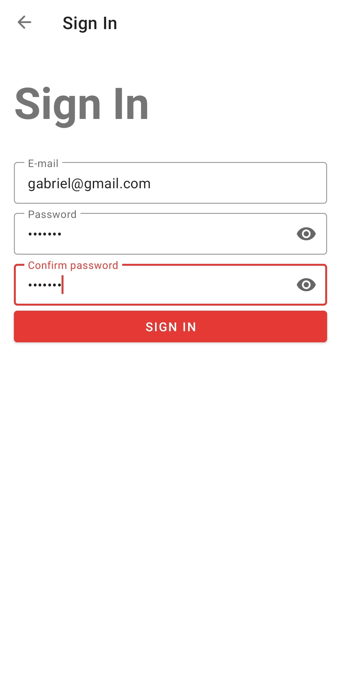</td>
        <td>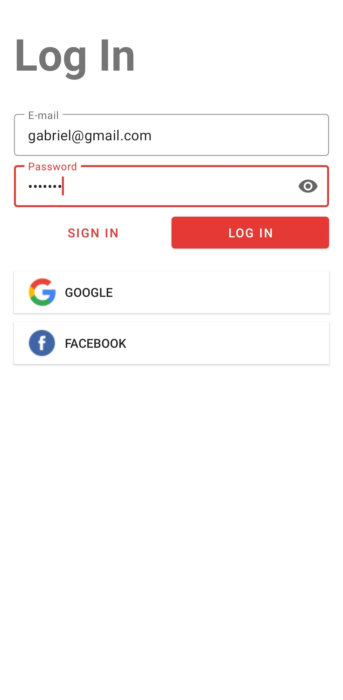</td>
        <td>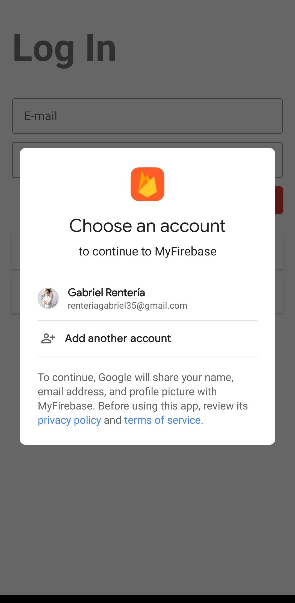</td>
    </tr>
</table>

### Home Screen

List of restaurants in the city of Mazatlán. Press 'View More' to see more details of the restaurant.

<table>
    <tr>
        <td>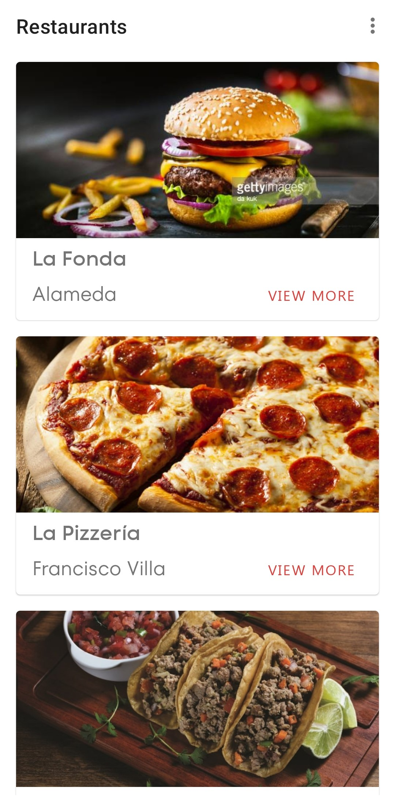</td>    
        <td>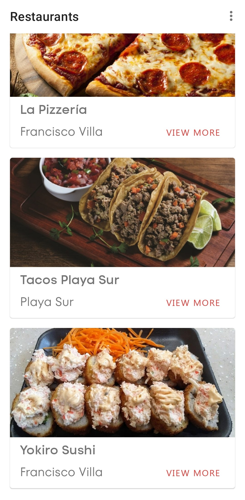</td>   
    </tr>
</table>

### Detail Screen

Detailed restaurant information such as: name, description, rating, website, phone, location.

* Press the Website icon to navigate to a URL
* Press the Phone icon to call the restaurant through dialer app

<table>
    <tr>
        <td>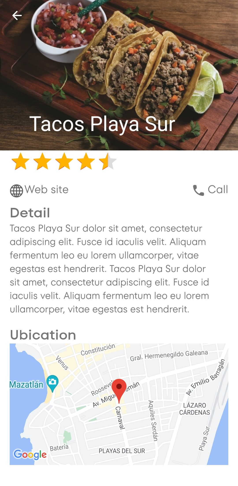</td>
        <td>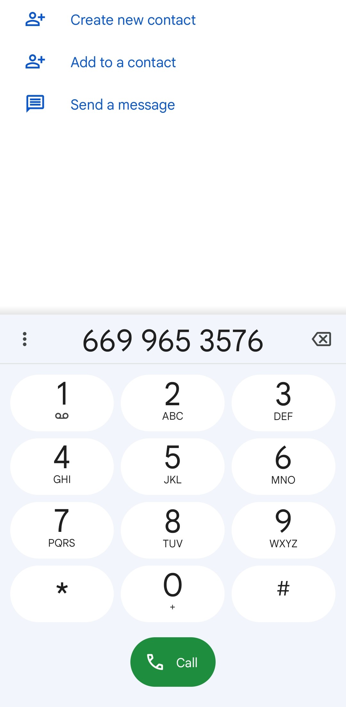</td>
        <td>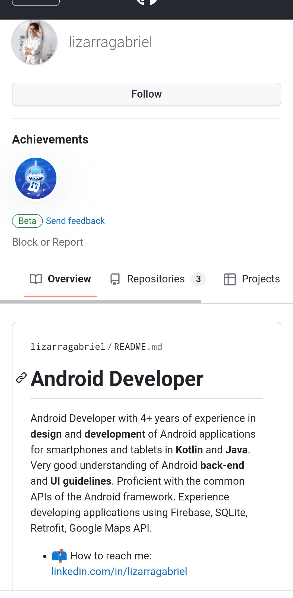</td>
    </tr>
</table>

* Here you can read reviews of other users, you can even write your own restaurant review. Also can see ubication in Google Maps application

<table>
    <tr>
        <td>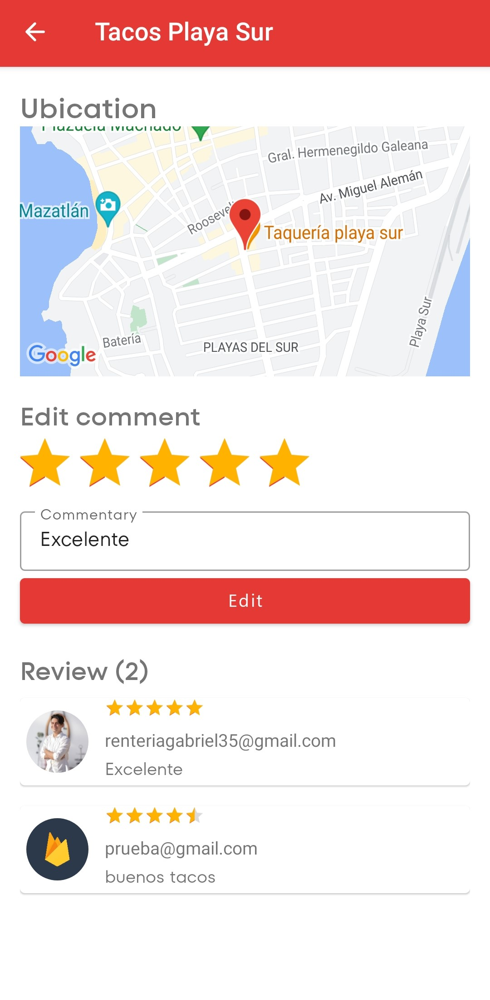</td>
        <td>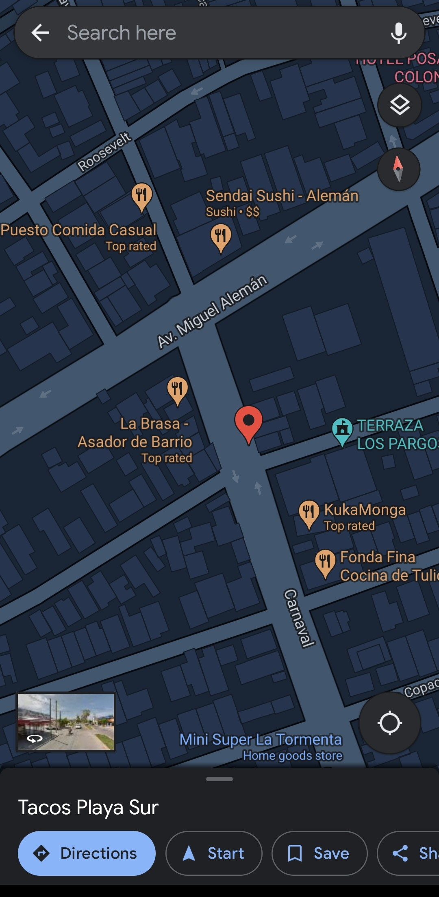</td>
    </tr>
</table>

### Firebase Firestore Structure

#### Restaurants
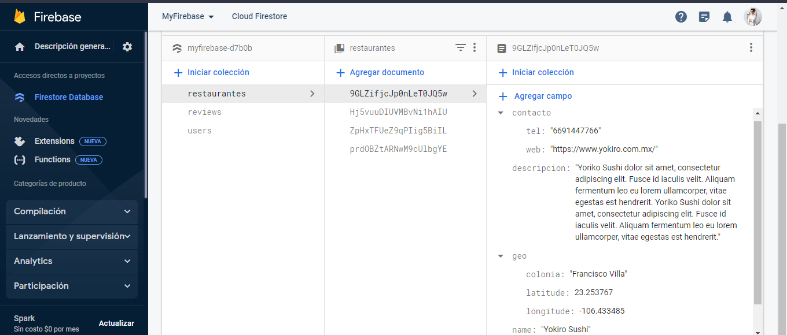

#### Reviews

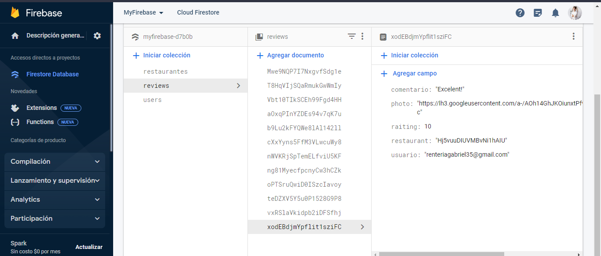

#### Users

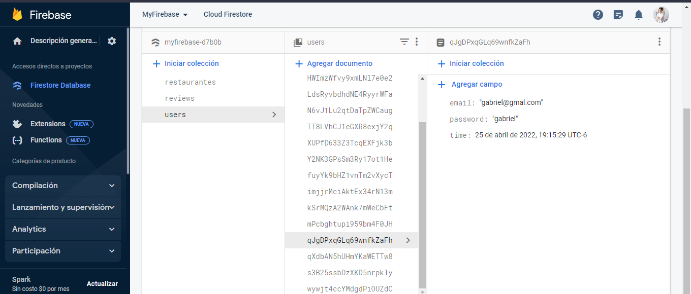